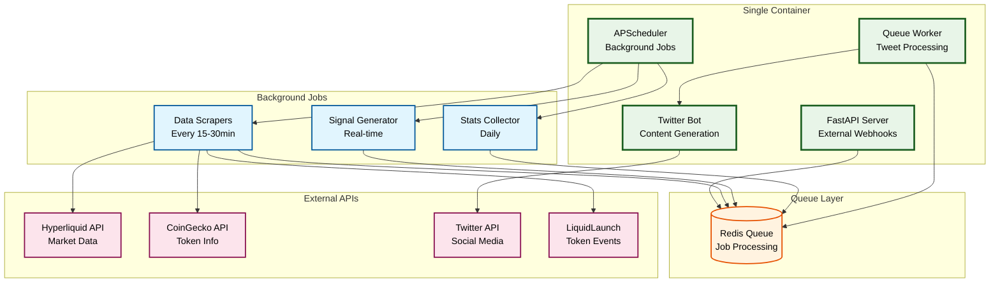

# hypexbt Twitter Bot

A Twitter bot system that tweets 10-20 times per day about Hyperliquid exchange, token launches, trading signals, stats, and token fundamentals. Built with a single-container architecture using Redis for queue processing, designed for easy future scaling.

## Architecture Overview

### Current System

The project uses a **single-container architecture** with Redis queue processing:

- **Single Service**: FastAPI backend + Twitter bot agent in one container
- **Redis Queue**: Handles background job processing and tweet scheduling
- **Background Jobs**: APScheduler runs data scraping and content generation
- **Future-Ready**: Designed to easily split into multiple containers when needed

### Architecture



### Data Flow

1. **Background Jobs**: APScheduler runs scrapers every 15-30 minutes
2. **Content Generation**: Jobs create tweet content and add to Redis queue
3. **Queue Processing**: Worker processes queue and posts tweets via Twitter API
4. **External Triggers**: API endpoints can add tweets directly to queue
5. **Real-time Signals**: WebSocket monitoring adds urgent tweets to queue

## Features

- **Intelligent Content Generation**: 6 different tweet types with configurable distribution
- **Redis Queue Processing**: Reliable background job processing with persistence
- **Smart Scheduling**: Respects rate limits and optimal posting times
- **Multi-source Integration**: Hyperliquid, CoinGecko, LiquidLaunch APIs
- **Monitoring & Alerts**: Slack notifications for errors and performance
- **Future-Ready Architecture**: Easy to split into multiple containers when scaling needed

### Content Types

- 15% → Retweets and quote-tweets from @HyperliquidExch / @HyperliquidLabs
- 20% → Fresh Token Launch announcements from LiquidLaunch
- 20% → Token Graduations/Migrations from LiquidLaunch
- 15% → Auto-generated perp trading signals (15-min & 1-h momentum crosses)
- 15% → Daily Hyperliquid stats (24h volume, OI, top gainer/loser)
- 15% → Token fundamental snapshots (circ supply, FDV, major backers)

## Project Structure

```
hypexbt/
├── src/                         # Main application code
│   ├── api/                     # FastAPI server and endpoints
│   ├── agent/                   # Twitter bot logic and scheduling
│   ├── core/                    # Core functionality and main entry
│   ├── messaging/               # Tweet generation engines
│   ├── sources/                 # Data source integrations
│   ├── queue/                   # Redis queue service and workers
│   └── utils/                   # Utility functions and config
├── docker/                      # Docker configurations
│   ├── Dockerfile               # Single container build
│   └── docker-compose.yml       # Local development with Redis
├── docs/                        # Documentation
│   ├── api.md                   # API documentation
│   ├── arch.md                  # Architecture details
│   └── deployment.md            # Deployment guides
├── tests/                       # Test suite
├── Makefile                     # Development commands
├── pyproject.toml               # Dependencies and configuration
└── README.md                    # This file
```

## Requirements

- Python 3.13+
- Redis (for queue processing)
- Twitter API credentials
- Hyperliquid API access
- CoinGecko API access (optional)
- Docker (for containerized deployment)

## Quick Start

### Local Development

```bash
# Clone the repository
git clone https://github.com/your-org/hypexbt.git
cd hypexbt

# Install uv (recommended package manager)
curl -LsSf https://astral.sh/uv/install.sh | sh

# Install dependencies
uv sync

# Set up environment variables
cp .env.example .env
# Edit .env with your API credentials

# Start Redis and the application
docker-compose up -d
```

### Docker Development

```bash
# Build and run all services (app + Redis)
docker-compose up -d

# View logs
docker-compose logs -f hypexbt-app

# Stop services
docker-compose down
```

## API Endpoints

The application provides several endpoints:

- `GET /` - Welcome message with system info
- `GET /health` - Health check endpoint
- `POST /api/tweet` - Trigger tweet generation (webhook endpoint)
- `GET /api/queue/status` - View queue status and metrics
- `POST /api/queue/clear` - Clear tweet queue (admin)

## Background Jobs

The system runs several background jobs via APScheduler:

### Scheduled Jobs

- **Daily Reset** (00:00 UTC): Reset tweet counters and generate daily schedule
- **Token Scraper** (every 30min): Check LiquidLaunch for new tokens/graduations
- **Signal Generator** (every 15min): Generate trading signals from Hyperliquid data
- **Stats Collector** (daily): Compile daily market statistics
- **News Scraper** (every 2 hours): Check official Twitter accounts for retweet content

### Queue Processing

- **Tweet Worker**: Continuously processes Redis queue and posts tweets
- **Rate Limiting**: Ensures 10-20 tweets per day with proper spacing
- **Error Handling**: Failed tweets are retried with exponential backoff

## Deployment

### Railway Deployment

1. **Create Railway Project**: Connect your GitHub repository
2. **Add Redis**: Add Redis service to your Railway project
3. **Configure Environment Variables**:

```bash
# Twitter API credentials
X_API_KEY=your_api_key
X_API_SECRET=your_api_secret
X_BEARER_TOKEN=your_bearer_token
X_ACCESS_TOKEN=your_access_token
X_ACCESS_TOKEN_SECRET=your_access_token_secret

# Redis connection
REDIS_URL=redis://redis:6379

# API endpoints
HL_API_URL=https://api.hyperliquid.xyz
COINGECKO_API=https://api.coingecko.com/api/v3

# Optional: Slack webhook for error reporting
SLACK_WEBHOOK=your_slack_webhook_url

# Tweet scheduling configuration
MIN_TWEETS_PER_DAY=10
MAX_TWEETS_PER_DAY=20
MIN_INTERVAL_MINUTES=30
MAX_INTERVAL_MINUTES=180
```

4. **Deploy**: Railway will automatically build and deploy your application

### Future Scaling

When you need to scale, the architecture easily splits into:

```
API Container:              Worker Container:
├── FastAPI Server         ├── APScheduler (background jobs)
├── Webhook Endpoints      ├── Queue Worker
└── Queue Publisher        ├── Tweet Generators
                          └── Twitter Client
            ↓                       ↑
        Redis Queue (shared between containers)
```

## Development Tools

This project uses modern Python tooling:

- **uv**: Fast Python package manager
- **ruff**: Lightning-fast linter and formatter
- **Redis**: Queue processing and caching
- **Docker**: Containerization for consistent environments
- **pytest**: Testing framework

### Common Commands

```bash
# Lint and format code
uv run ruff check .
uv run ruff format .

# Run tests
uv run pytest

# Start development environment
docker-compose up -d

# View application logs
docker-compose logs -f hypexbt-app

# See all available commands
make help
```

## API Documentation

The API service provides:

- `GET /` - Welcome message with system info
- `GET /health` - Health check endpoint
- `GET /api/echo/{message}` - Echo endpoint for testing

See [docs/api.md](docs/api.md) for detailed API documentation.

## Architecture Details

For detailed technical documentation:

- [Architecture Overview](docs/arch.md) - System design and data flow
- [Deployment Guides](docs/deployment.md) - Deployment and scaling strategies
- [API Documentation](docs/api.md) - API endpoints and usage

## Contributing

1. Fork the repository
2. Create a feature branch: `git checkout -b feature-name`
3. Make your changes and add tests
4. Run linting and tests: `make test`
5. Commit your changes: `git commit -am 'Add feature'`
6. Push to the branch: `git push origin feature-name`
7. Create a Pull Request

## License

MIT License - see [LICENSE](LICENSE) file for details.
