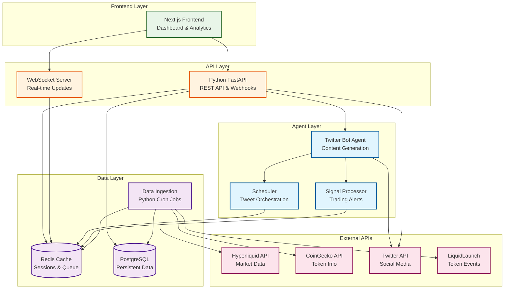

# hypexbt Twitter Bot

A Twitter bot system that tweets 10-20 times per day about Hyperliquid exchange, token launches, trading signals, stats, and token fundamentals. Built as a modular monorepo with separate API and agent services.

## Architecture Overview

### Current System

The project is structured as a monorepo with two main services:

- **API Service**: FastAPI backend for webhooks and external integrations
- **Agent Service**: Twitter bot with intelligent scheduling and content generation

### Architecture



## Features

- **Intelligent Content Generation**: 6 different tweet types with configurable distribution
- **Real-time Monitoring**: WebSocket connections for live trading signals
- **Smart Scheduling**: Respects rate limits and optimal posting times
- **Multi-source Integration**: Hyperliquid, CoinGecko, LiquidLaunch APIs
- **Monitoring & Alerts**: Slack notifications for errors and performance
- **Modular Architecture**: Separate services for API and bot functionality

### Content Types

- 15% → Retweets and quote-tweets from @HyperliquidExch / @HyperliquidLabs
- 20% → Fresh Token Launch announcements from LiquidLaunch
- 20% → Token Graduations/Migrations from LiquidLaunch
- 15% → Auto-generated perp trading signals (15-min & 1-h momentum crosses)
- 15% → Daily Hyperliquid stats (24h volume, OI, top gainer/loser)
- 15% → Token fundamental snapshots (circ supply, FDV, major backers)

## Project Structure

```
hypexbt/
├── api/                         # FastAPI backend service
│   ├── main.py                  # API server with health/echo endpoints
│   ├── pyproject.toml           # API dependencies
│   └── .tool-versions           # Python version
├── agent/                       # Twitter bot service
│   ├── src/                     # Agent source code
│   │   ├── agent/               # Bot logic and scheduling
│   │   ├── api/                 # API clients
│   │   ├── core/                # Core functionality
│   │   ├── messaging/           # Tweet generation
│   │   ├── sources/             # Data source integrations
│   │   └── utils/               # Utility functions
│   ├── pyproject.toml           # Agent dependencies
│   └── .tool-versions           # Python version
├── docker/                      # Docker configurations
│   ├── Dockerfile.api           # API service container
│   ├── Dockerfile.agent         # Agent service container
│   └── docker-compose.yml       # Local development setup
├── docs/                        # Documentation
│   ├── api.md                   # API documentation
│   ├── arch.md                  # Architecture details
│   └── monorepo.md              # Monorepo strategy
├── tests/                       # Test suite
├── Makefile                     # Development commands
├── pyproject.toml               # Root project configuration
└── README.md                    # This file
```

## Requirements

- Python 3.13+
- Twitter API credentials
- Hyperliquid API access
- CoinGecko API access (optional)
- Docker (for containerized deployment)

## Quick Start

### Local Development

```bash
# Clone the repository
git clone https://github.com/your-org/hypexbt.git
cd hypexbt

# Install uv (recommended package manager)
curl -LsSf https://astral.sh/uv/install.sh | sh

# Install dependencies
uv sync

# Set up environment variables
cp .env.example .env
# Edit .env with your API credentials

# Run the API service
make dev-api

# Run the agent service (in another terminal)
cd agent
uv run python -m src.main
```

### Docker Development

```bash
# Build and run all services
docker-compose up -d

# View logs
docker-compose logs -f

# Stop services
docker-compose down
```

## Deployment on Railway

### 1. Fork and Connect Repository

1. Fork this repository to your GitHub account
2. Sign up for [Railway](https://railway.app) if you haven't already
3. Create a new project and connect your GitHub repository

### 2. Deploy API Service

1. Create a new service in Railway
2. **Name**: `hypexbt-api`
3. **Root Directory**: `api`
4. **Build Command**: `pip install -e .`
5. **Start Command**: `python main.py`
6. **Port**: `8000`

### 3. Deploy Agent Service

1. Create another service in Railway
2. **Name**: `hypexbt-agent`
3. **Root Directory**: `agent`
4. **Build Command**: `pip install -e .`
5. **Start Command**: `python -m src.main`

### 4. Configure Environment Variables

Add these environment variables to both services:

```bash
# Twitter API credentials
X_API_KEY=your_api_key
X_API_SECRET=your_api_secret
X_BEARER_TOKEN=your_bearer_token
X_ACCESS_TOKEN=your_access_token
X_ACCESS_TOKEN_SECRET=your_access_token_secret

# API endpoints
HL_API_URL=https://api.hyperliquid.xyz
COINGECKO_API=https://api.coingecko.com/api/v3

# Optional: Slack webhook for error reporting
SLACK_WEBHOOK=your_slack_webhook_url

# Optional: Tweet scheduling configuration
MIN_TWEETS_PER_DAY=10
MAX_TWEETS_PER_DAY=20
MIN_INTERVAL_MINUTES=30
MAX_INTERVAL_MINUTES=180
```

### 5. Database Setup (Future)

For the future architecture with PostgreSQL:

1. Add a PostgreSQL database service in Railway
2. Connect it to both API and agent services
3. Update environment variables with database credentials

## Development Tools

This project uses modern Python tooling:

- **uv**: Fast Python package manager
- **ruff**: Lightning-fast linter and formatter
- **Docker**: Containerization for consistent environments
- **pytest**: Testing framework

### Common Commands

```bash
# Lint and format code
uv run ruff check .
uv run ruff format .

# Run tests
uv run pytest

# Build API service
make build-api

# Test API endpoints
make test-api

# See all available commands
make help
```

## API Documentation

The API service provides:

- `GET /` - Welcome message with system info
- `GET /health` - Health check endpoint
- `GET /api/echo/{message}` - Echo endpoint for testing

See [docs/api.md](docs/api.md) for detailed API documentation.

## Architecture Details

For detailed technical documentation:

- [Architecture Overview](docs/arch.md) - System design and data flow
- [Monorepo Strategy](docs/monorepo.md) - Project structure and development workflow
- [API Documentation](docs/api.md) - API endpoints and usage

## Contributing

1. Fork the repository
2. Create a feature branch: `git checkout -b feature-name`
3. Make your changes and add tests
4. Run linting and tests: `make test`
5. Commit your changes: `git commit -am 'Add feature'`
6. Push to the branch: `git push origin feature-name`
7. Create a Pull Request

## License

MIT License - see [LICENSE](LICENSE) file for details.
