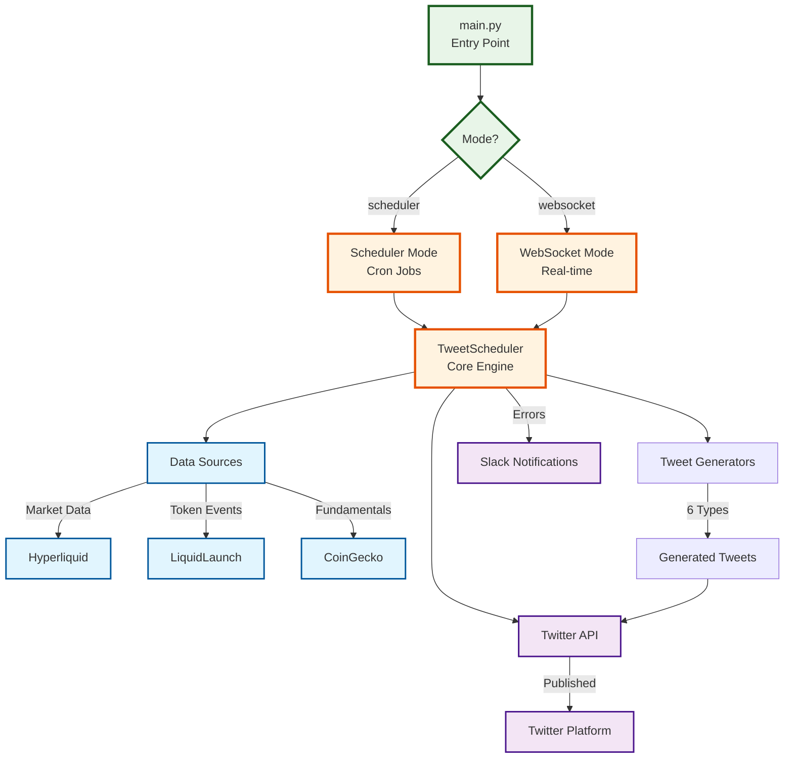
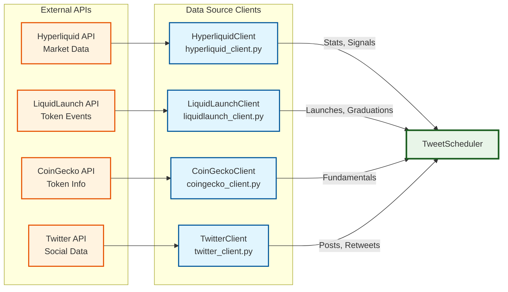
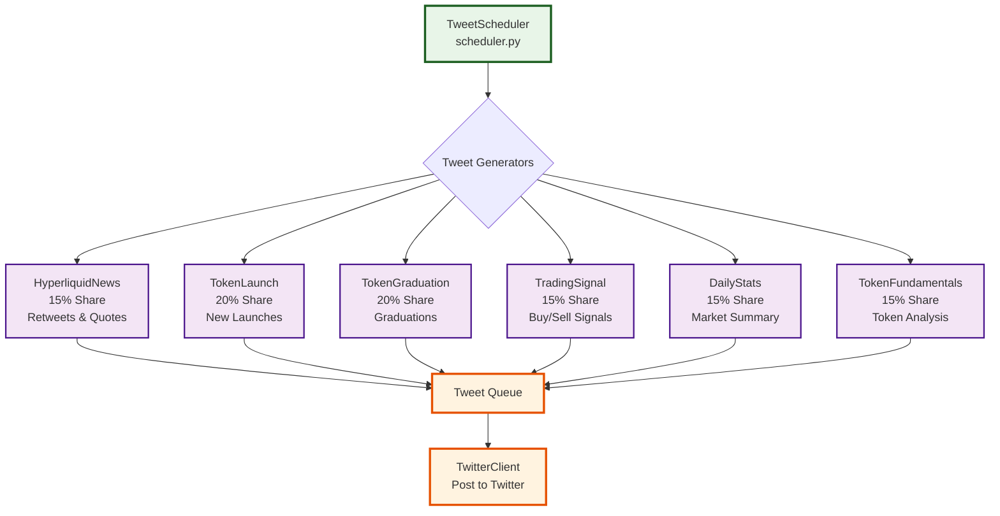
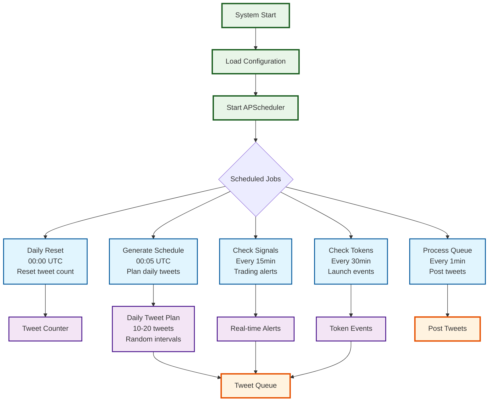
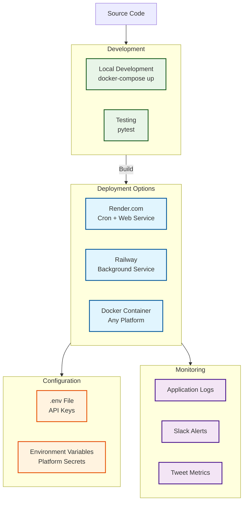

# hypexbt Twitter Bot Architecture

## Executive Summary

The **hypexbt Twitter Bot** is a sophisticated automated social media system that generates and posts 10-20 tweets per day about Hyperliquid exchange activities, token launches, trading signals, market statistics, and token fundamentals. The bot operates in two modes: **scheduler mode** (for regular tweet scheduling) and **websocket mode** (for real-time trading signal monitoring).

The system integrates with multiple external APIs:

- **Twitter API** for posting tweets, retweets, and quote tweets
- **Hyperliquid API** for market data, trading signals, and daily statistics
- **LiquidLaunch API** for token launch and graduation events
- **CoinGecko API** for token fundamental data
- **Slack** for error notifications and monitoring

Content is distributed across 6 categories with configurable percentages, scheduled intelligently throughout the day while respecting rate limits and maintaining tweet quality.

## System Architecture Overview

### High-Level System Flow

### Data Sources Architecture

### Tweet Generation System

### Scheduling System Details

### Deployment Architecture

## Component Details

### Core Components

#### 1. **main.py** - Application Entry Point

- **Purpose**: CLI interface and application bootstrap
- **Modes**: Scheduler mode (cron jobs) or WebSocket mode (real-time)
- **Functions**: Argument parsing, logging setup, configuration loading

#### 2. **scheduler.py** - Tweet Scheduler (Core Orchestrator)

- **Purpose**: Central orchestration of all tweet activities
- **Key Features**:
  - APScheduler-based job management
  - Tweet queue processing
  - Rate limiting (10-20 tweets/day)
  - Content distribution (6 categories)
  - Real-time signal monitoring
- **Jobs**:
  - Daily reset at midnight
  - Schedule generation
  - Trading signal checks (15min intervals)
  - Token event checks (30min intervals)
  - Queue processing (1min intervals)

#### 3. **twitter_client.py** - Twitter API Interface

- **Purpose**: All Twitter API interactions
- **Features**:
  - Tweet posting with character limit validation
  - Retweets and quote tweets
  - Timeline fetching (@HyperliquidExch, @LiquidLaunchHL)
  - Rate limit handling
  - Media upload support

### Data Source Clients

#### 4. **hyperliquid_client.py** - Hyperliquid Integration

- **Purpose**: Market data and trading signal generation
- **Features**:
  - Metadata and ticker data
  - Candlestick data with caching
  - Daily statistics calculation
  - Momentum-based trading signals (EMA crossovers)
  - WebSocket streaming for real-time data
  - Rate limiting and caching

#### 5. **liquidlaunch_client.py** - LiquidLaunch Integration

- **Purpose**: Token launch and graduation event monitoring
- **Features**:
  - Launch event detection
  - Graduation event monitoring
  - GitBook feed parsing
  - Token metadata extraction

#### 6. **coingecko_client.py** - CoinGecko Integration

- **Purpose**: Token fundamental data
- **Features**:
  - Market cap and supply data
  - Price information
  - Token metadata and descriptions
  - Rate limiting and caching

### Tweet Generators (Content Engines)

#### 7. **hyperliquid_news.py** - News & Social Content (15%)

- **Purpose**: Retweets and quote tweets from official accounts
- **Sources**: @HyperliquidExch, @HyperliquidLabs
- **Content**: News, announcements, community memes

#### 8. **token_launch.py** - Token Launch Announcements (20%)

- **Purpose**: Fresh token launch notifications
- **Sources**: LiquidLaunch feed and timeline
- **Content**: New token details, launch metrics

#### 9. **token_graduation.py** - Token Graduations (20%)

- **Purpose**: Token migration/graduation events
- **Sources**: LiquidLaunch graduation data
- **Content**: Graduation announcements, migration details

#### 10. **trading_signal.py** - Trading Signals (15%)

- **Purpose**: Auto-generated perp trading signals
- **Analysis**: 15-min and 1-hour momentum crossovers
- **Content**: Buy/sell signals with technical analysis

#### 11. **daily_stats.py** - Market Statistics (15%)

- **Purpose**: Daily Hyperliquid market overview
- **Metrics**: 24h volume, open interest, top gainers/losers
- **Content**: Market summary tweets

#### 12. **token_fundamentals.py** - Token Analysis (15%)

- **Purpose**: Token fundamental snapshots
- **Data**: Circulating supply, FDV, major backers
- **Content**: Token analysis and metrics

### Utility Modules

#### 13. **config.py** - Configuration Management

- **Purpose**: Environment variable handling and validation
- **Features**: API credentials, scheduling parameters, content distribution

#### 14. **slack.py** - Error Monitoring

- **Purpose**: Slack webhook notifications for errors and alerts
- **Features**: Error reporting, system health monitoring

#### 15. **logging_setup.py** - Logging Infrastructure

- **Purpose**: Structured logging configuration
- **Features**: JSON logging, log levels, file output

### Testing Infrastructure

#### 16. **test\_\*.py** - Test Suite

- **Coverage**: All major components
- **Features**:
  - Mock API endpoints
  - Character limit validation
  - Scheduler frequency testing
  - Tweet generation testing

### Configuration Files

#### 17. **requirements.txt** - Python Dependencies

- **Key Libraries**: tweepy, APScheduler, requests, websockets, pandas, numpy

#### 18. **Dockerfile & docker-compose.yml** - Containerization

- **Services**: Scheduler service, WebSocket service
- **Features**: Multi-service deployment, environment isolation

#### 19. **.env.example** - Environment Template

- **Credentials**: Twitter API, Slack webhook
- **Configuration**: Tweet limits, scheduling parameters, content distribution

## Data Flow

1. **Initialization**: Load config, initialize clients and generators
2. **Scheduling**: Generate daily tweet schedule with random intervals
3. **Content Generation**: Each generator creates tweets based on fresh data
4. **Queue Processing**: Tweets are queued and posted respecting rate limits
5. **Real-time Monitoring**: WebSocket mode handles immediate trading signals
6. **Error Handling**: Failures reported via Slack, cached data used as fallback

## Deployment Modes

### Scheduler Mode (Primary)

- Runs as cron job or background service
- Handles all scheduled tweet activities
- Used by Render.com cron jobs and Railway

### WebSocket Mode

- Continuous real-time monitoring
- Immediate posting of trading signals
- Complements scheduler mode for time-sensitive content

The architecture is designed for resilience, scalability, and maintainability, with clear separation of concerns and comprehensive error handling throughout the system.
