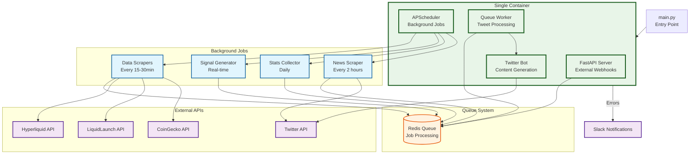
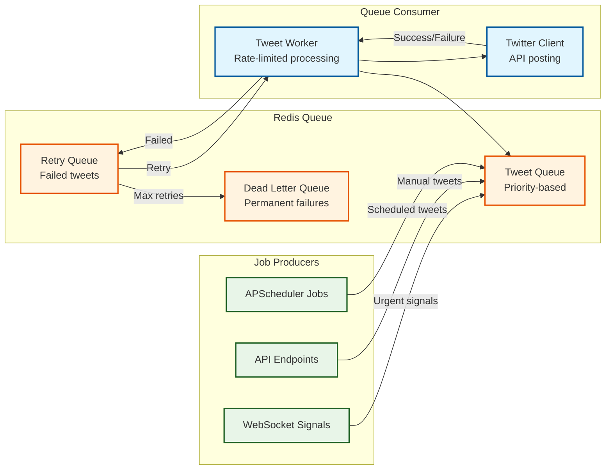
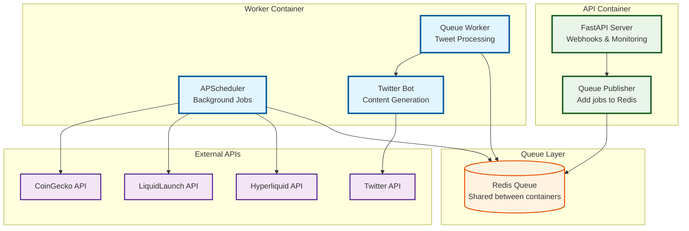
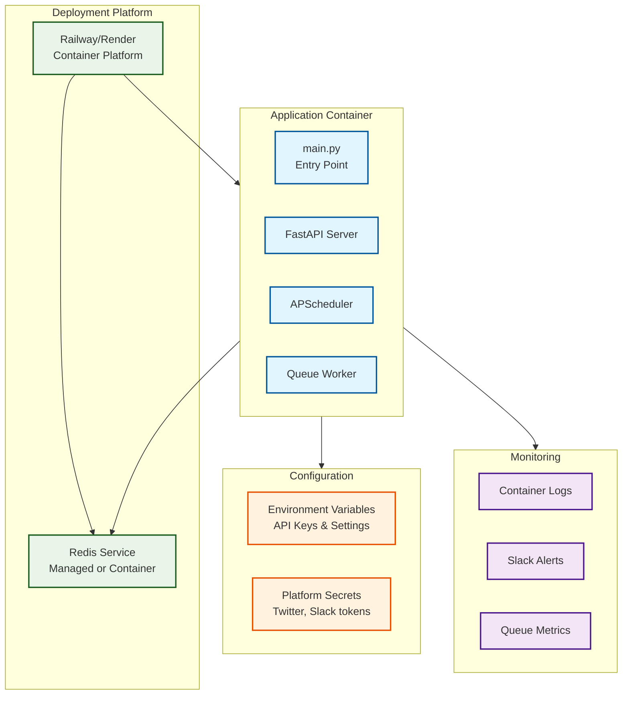

# hypexbt Twitter Bot Architecture

## Executive Summary

The **hypexbt Twitter Bot** is a sophisticated automated social media system that generates and posts 10-20 tweets per day about Hyperliquid exchange activities, token launches, trading signals, market statistics, and token fundamentals. The system uses a **single-container architecture** with Redis queue processing, designed for simplicity and easy future scaling.

The system integrates with multiple external APIs:

- **Twitter API** for posting tweets, retweets, and quote tweets
- **Hyperliquid API** for market data, trading signals, and daily statistics
- **LiquidLaunch API** for token launch and graduation events
- **CoinGecko API** for token fundamental data
- **Slack** for error notifications and monitoring

Content is distributed across 6 categories with configurable percentages, scheduled intelligently throughout the day while respecting rate limits and maintaining tweet quality. The architecture uses Redis for reliable queue processing and is designed to easily split into multiple containers when scaling is needed.

## System Architecture Overview

### High-Level System Flow

### Queue Processing Architecture

### Future Scaling Architecture

When scaling is needed, the system easily splits into multiple containers:

## Component Details

### Core Components

#### 1. **main.py** - Application Entry Point

- **Purpose**: CLI interface and application bootstrap
- **Modes**: Single mode that runs all components together
- **Functions**: Argument parsing, logging setup, configuration loading, service orchestration

#### 2. **api/server.py** - FastAPI Server

- **Purpose**: External webhook endpoints and monitoring
- **Key Features**:
  - Health check endpoints
  - Tweet trigger endpoints (`POST /api/tweet`)
  - Queue status monitoring (`GET /api/queue/status`)
  - Admin endpoints for queue management
- **Integration**: Publishes jobs to Redis queue

#### 3. **queue/service.py** - Redis Queue Service

- **Purpose**: Centralized queue management and processing
- **Key Features**:
  - Job publishing and consuming
  - Priority-based processing
  - Retry logic with exponential backoff
  - Dead letter queue for permanent failures
  - Rate limiting and throttling

#### 4. **agent/scheduler.py** - Background Job Scheduler

- **Purpose**: APScheduler-based background job management
- **Key Features**:
  - Data scraping jobs (every 15-30 minutes)
  - Daily statistics collection
  - Real-time signal monitoring
  - Tweet content generation
  - Job result publishing to Redis queue
- **Jobs**:
  - Daily reset at midnight
  - Token launch monitoring (30min intervals)
  - Trading signal generation (15min intervals)
  - News scraping (2 hour intervals)
  - Daily statistics compilation

#### 5. **queue/worker.py** - Tweet Queue Worker

- **Purpose**: Processes Redis queue and posts tweets
- **Key Features**:
  - Continuous queue monitoring
  - Rate limiting (10-20 tweets/day)
  - Tweet validation and formatting
  - Error handling and retry logic
  - Twitter API integration

### Data Source Clients

#### 6. **sources/hyperliquid_client.py** - Hyperliquid Integration

- **Purpose**: Market data and trading signal generation
- **Features**:
  - Metadata and ticker data
  - Candlestick data with caching
  - Daily statistics calculation
  - Momentum-based trading signals (EMA crossovers)
  - WebSocket streaming for real-time data
  - Rate limiting and caching

#### 7. **sources/liquidlaunch_client.py** - LiquidLaunch Integration

- **Purpose**: Token launch and graduation event monitoring
- **Features**:
  - Launch event detection
  - Graduation event monitoring
  - GitBook feed parsing
  - Token metadata extraction

#### 8. **sources/coingecko_client.py** - CoinGecko Integration

- **Purpose**: Token fundamental data
- **Features**:
  - Market cap and supply data
  - Price information
  - Token metadata and descriptions
  - Rate limiting and caching

#### 9. **sources/twitter_client.py** - Twitter API Interface

- **Purpose**: All Twitter API interactions
- **Features**:
  - Tweet posting with character limit validation
  - Retweets and quote tweets
  - Timeline fetching (@HyperliquidExch, @LiquidLaunchHL)
  - Rate limit handling
  - Media upload support

### Tweet Generators (Content Engines)

#### 10. **messaging/hyperliquid_news.py** - News & Social Content (15%)

- **Purpose**: Retweets and quote tweets from official accounts
- **Sources**: @HyperliquidExch, @HyperliquidLabs
- **Content**: News, announcements, community memes

#### 11. **messaging/token_launch.py** - Token Launch Announcements (20%)

- **Purpose**: Fresh token launch notifications
- **Sources**: LiquidLaunch feed and timeline
- **Content**: New token details, launch metrics

#### 12. **messaging/token_graduation.py** - Token Graduations (20%)

- **Purpose**: Token migration/graduation events
- **Sources**: LiquidLaunch graduation data
- **Content**: Graduation announcements, migration details

#### 13. **messaging/trading_signal.py** - Trading Signals (15%)

- **Purpose**: Auto-generated perp trading signals
- **Analysis**: 15-min and 1-hour momentum crossovers
- **Content**: Buy/sell signals with technical analysis

#### 14. **messaging/daily_stats.py** - Market Statistics (15%)

- **Purpose**: Daily Hyperliquid market overview
- **Metrics**: 24h volume, open interest, top gainers/losers
- **Content**: Market summary tweets

#### 15. **messaging/token_fundamentals.py** - Token Analysis (15%)

- **Purpose**: Token fundamental snapshots
- **Data**: Circulating supply, FDV, major backers
- **Content**: Token analysis and metrics

### Utility Modules

#### 16. **utils/config.py** - Configuration Management

- **Purpose**: Environment variable handling and validation
- **Features**: API credentials, scheduling parameters, content distribution, Redis configuration

#### 17. **utils/slack.py** - Error Monitoring

- **Purpose**: Slack webhook notifications for errors and alerts
- **Features**: Error reporting, system health monitoring, queue status alerts

#### 18. **utils/logging_setup.py** - Logging Infrastructure

- **Purpose**: Structured logging configuration
- **Features**: JSON logging, log levels, file output, Redis queue logging

## Data Flow

### Background Job Flow

1. **APScheduler** triggers background jobs at scheduled intervals
2. **Data scrapers** fetch fresh data from external APIs
3. **Content generators** create tweet content from scraped data
4. **Jobs publish** tweet data to Redis queue with priority and metadata
5. **Queue worker** processes jobs and posts tweets via Twitter API

### External API Flow

1. **External webhook** hits FastAPI endpoint (`POST /api/tweet`)
2. **API validates** payload and creates tweet job
3. **Job published** to Redis queue with high priority
4. **Queue worker** processes job immediately (respecting rate limits)
5. **Response returned** to webhook caller with job status

### Real-time Signal Flow

1. **WebSocket connection** monitors Hyperliquid for trading signals
2. **Signal detected** triggers immediate tweet generation
3. **Urgent tweet** added to Redis queue with highest priority
4. **Queue worker** processes signal tweet as soon as rate limits allow

## Queue System Details

### Job Types and Priorities

- **Priority 1 (Urgent)**: Trading signals, breaking news
- **Priority 2 (High)**: Token launches, graduations
- **Priority 3 (Normal)**: Daily stats, fundamentals
- **Priority 4 (Low)**: Retweets, general content

### Rate Limiting Strategy

- **Daily limit**: 10-20 tweets maximum
- **Minimum interval**: 30 minutes between tweets
- **Maximum interval**: 3 hours between tweets
- **Burst protection**: No more than 3 tweets per hour

### Error Handling

- **Immediate retry**: Network errors, temporary API issues
- **Exponential backoff**: Rate limit errors, server errors
- **Dead letter queue**: Permanent failures after 3 retries
- **Slack notifications**: All errors and queue status changes

## Deployment Architecture

### Single Container Deployment

## Benefits of Single Container Architecture

### Development Benefits

- **Simplified setup**: One container to build and run
- **Easier debugging**: All logs in one place
- **Faster iteration**: No inter-service communication overhead
- **Reduced complexity**: Single deployment unit

### Operational Benefits

- **Lower resource usage**: Shared memory and CPU
- **Simpler monitoring**: One service to monitor
- **Easier scaling**: Scale entire application together
- **Reduced network overhead**: No container-to-container calls

### Future Scaling Path

- **Easy separation**: Clean module boundaries enable easy splitting
- **Shared queue**: Redis queue works for both single and multi-container
- **No refactoring**: Same code works in both architectures
- **Gradual migration**: Can split components one at a time

The architecture is designed for **simplicity first**, with clear paths to **scale when needed**. The Redis queue provides the foundation for reliable processing in both single and multi-container deployments.
