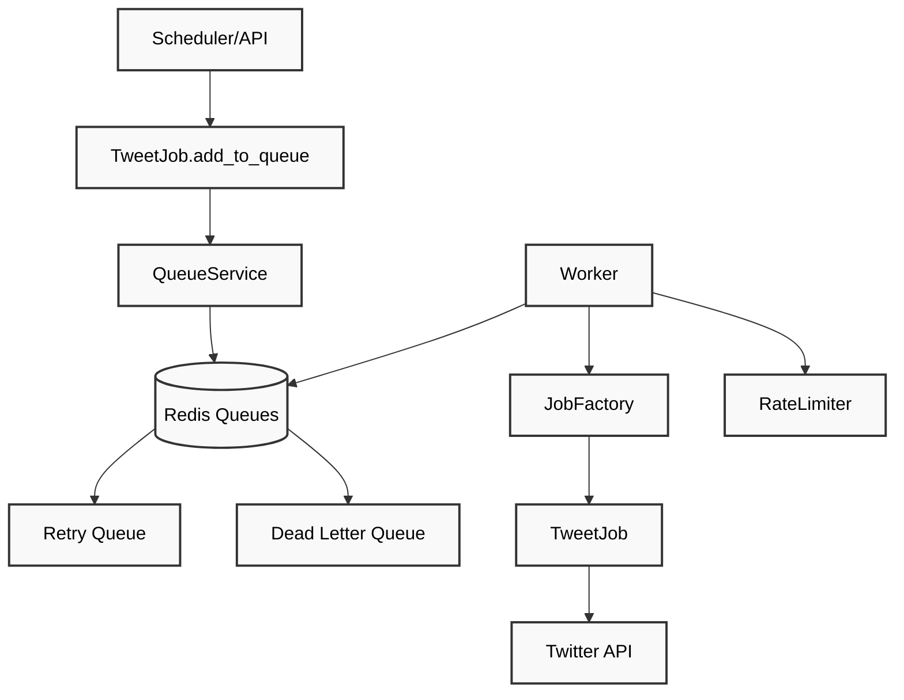
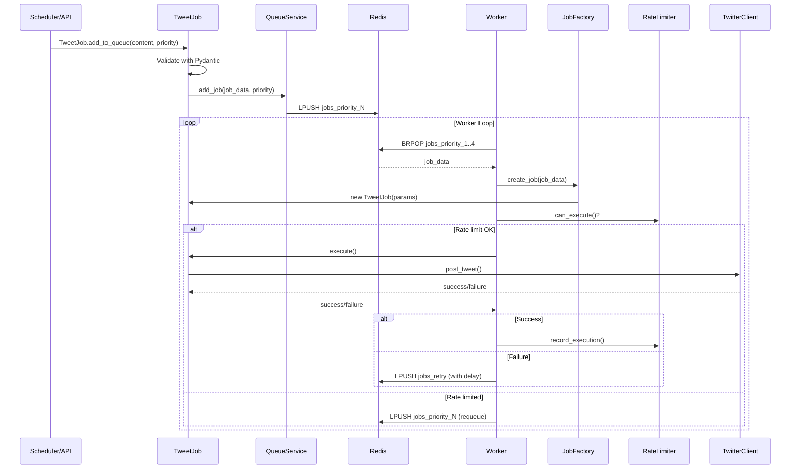

# Queue Worker System Architecture

## Overview

The Queue Worker System is a generic, type-safe job processing framework built on Redis. It provides a clean separation between job types and the processing infrastructure, allowing easy extension for new job types while maintaining reliability through rate limiting, retry logic, and error handling.

## Architecture Diagram



### Simple Flow

1. **Job Creation**: `TweetJob.add_to_queue()` → `QueueService` → `Redis`
2. **Job Processing**: `Worker` pulls from `Redis` → `JobFactory` creates `TweetJob` → Posts to `Twitter`
3. **Error Handling**: Failed jobs go to `Retry Queue` or `Dead Letter Queue`

## Core Components

### 1. **Worker** (`src/queue/worker.py`)

The main job processor that:

- Pulls jobs from Redis queues by priority (1=urgent → 4=low)
- Creates job instances using JobFactory
- Enforces rate limiting per job type
- Handles retry logic with exponential backoff
- Manages dead letter queue for permanent failures

**Key Features:**

- Generic - works with any job type
- Rate limiting per job type
- Automatic retry with exponential backoff (1min, 2min, 4min)
- Dead letter queue after 3 failed attempts

### 2. **QueueService** (`src/queue/service.py`)

Generic Redis queue operations:

- `add_job(job_data, priority)` - Add any job to queue
- `get_queue_stats()` - Monitor queue health
- `get_retry_jobs()` - Process failed jobs ready for retry
- `clear_queue()` - Admin operations

**Queue Structure:**

- **Priority Queues**: `jobs_priority_1` through `jobs_priority_4`
- **Retry Queue**: `jobs_retry` (time-delayed retries)
- **Dead Letter Queue**: `jobs_dead_letter` (permanent failures)

### 3. **Job System** (`src/queue/jobs/`)

#### BaseJob Interface

```python
class BaseJob(ABC):
    async def execute(self) -> bool
    def get_rate_limit_key(self) -> str
    def get_retry_config(self) -> dict
```

#### JobFactory

Type-safe job creation with Pydantic validation:

```python
job = JobFactory.create_job(job_data, config, clients)
```

#### TweetJob Implementation

```python
class TweetJobParams(BaseJobParams):
    job_type: Literal["tweet"] = "tweet"
    content: str = Field(min_length=1, max_length=280)
    media_ids: Optional[List[str]] = None
```

### 4. **Rate Limiting** (`src/queue/rate_limiter.py`)

Per-job-type rate limiting with:

- Daily limits
- Hourly limits (burst protection)
- Minimum intervals between executions
- Automatic counter resets

### 5. **Client Container** (`src/queue/clients.py`)

Dependency injection for job dependencies:

- Lazy initialization of clients
- Shared across all jobs of the same type
- Easy to extend for new client types

## Job Lifecycle



## Usage Examples

### Adding a Tweet Job

```python
# Method 1: Using TweetJob class method
job_id = await TweetJob.add_to_queue(
    queue_service,
    content="Hello world!",
    priority=2,
    media_ids=["123", "456"]
)

# Method 2: Direct queue service (not recommended)
job_data = {
    "job_type": "tweet",
    "content": "Hello world!",
    "media_ids": ["123", "456"]
}
job_id = await queue_service.add_job(job_data, priority=2)
```

### Monitoring Queue Health

```python
stats = await queue_service.get_queue_stats()
# Returns:
# {
#   "total_jobs": 5,
#   "queues": {
#     "jobs_priority_1": 0,
#     "jobs_priority_2": 2,
#     "jobs_priority_3": 3,
#     "jobs_priority_4": 0
#   },
#   "total_processed": "42"
# }

worker_stats = await worker.get_worker_stats()
# Returns rate limiter stats per job type
```

### Adding New Job Types

1. **Create Job Parameters**:

```python
class DataJobParams(BaseJobParams):
    job_type: Literal["data_collection"] = "data_collection"
    api_endpoint: str
    data_format: str
```

2. **Implement Job Class**:

```python
class DataJob(BaseJob):
    async def execute(self) -> bool:
        # Implementation here
        pass

    def get_rate_limit_key(self) -> str:
        return "data_collection"

    @classmethod
    async def add_to_queue(cls, queue_service, **kwargs):
        # Job creation logic
        pass
```

3. **Register with Factory**:

```python
JobFactory.register_job_type("data_collection", DataJob, DataJobParams)
```

## Configuration

### Rate Limiting

Rate limits are configured per job type in the Worker:

```python
def _setup_rate_limiters(self) -> None:
    tweet_schedule = self.config.get_tweet_schedule()

    self.rate_limiters["tweet"] = RateLimiter(
        max_per_day=tweet_schedule["max_tweets_per_day"],
        max_per_hour=3,
        min_interval_minutes=tweet_schedule["min_interval_minutes"]
    )
```

### Redis Configuration

```python
queue_service = QueueService(config.redis_url)
# Default: "redis://localhost:6379"
```

## Error Handling

### Retry Logic

- **Immediate Retry**: Rate limit errors, temporary failures
- **Exponential Backoff**: 1min → 2min → 4min delays
- **Dead Letter Queue**: After 3 failed attempts

### Error Types

- **Validation Errors**: Invalid job parameters (immediate failure)
- **Rate Limit Errors**: Job requeued for later processing
- **Execution Errors**: Job moved to retry queue
- **Permanent Failures**: Job moved to dead letter queue

## Benefits

### Type Safety

- Pydantic validation for all job parameters
- Compile-time type checking with mypy
- Clear parameter contracts

### Extensibility

- Easy to add new job types
- No changes required to core infrastructure
- Self-contained job implementations

### Reliability

- Automatic retry with exponential backoff
- Dead letter queue for debugging
- Rate limiting prevents API abuse
- Redis persistence survives restarts

### Monitoring

- Queue statistics and health metrics
- Rate limiter statistics per job type
- Failed job tracking and analysis

## Future Enhancements

1. **Job Composition**: Support for job chains and workflows
2. **Scheduled Jobs**: Cron-like scheduling for recurring jobs
3. **Job Dependencies**: Jobs that depend on other jobs
4. **Metrics Export**: Prometheus/Grafana integration
5. **Admin UI**: Web interface for queue management
